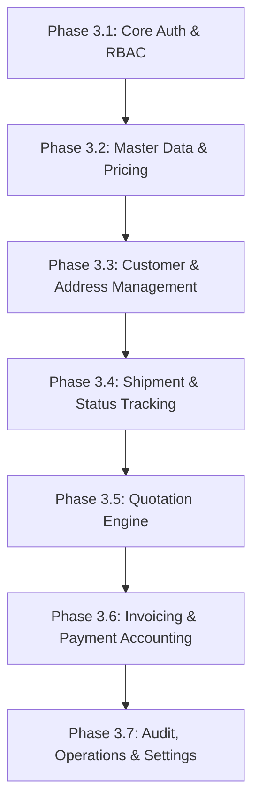

# UAE Logistics Platform — Comprehensive Implementation Plan

## 1. Current Project State

### Repository Inspection
An audit of the `d:\RC courier` repository reveals that it currently consists of **12 specification markdown files** defining the product scope, requirements, database schema, security rules, and deployment instructions:
* `README.md` — Overview and target stack
* `AGENT.md` — Guidelines, non-negotiable principles, and definition of done
* `PROMPT.md` — Complete master prompt with exhaustive functional details
* `ARCHITECTURE.md` — MVC/Service layer design and ID conventions
* `DATABASE.md` — Detailed table definitions and indexing constraints
* `SECURITY.md` — Comprehensive security checklist
* `ROUTES.md` — Full URI and HTTP method mapping
* `UI.md` — Design benchmarks, visual direction, and component list
* `API.md` — Internal JSON response contracts
* `DEPLOYMENT.md` — Hostinger Business shared hosting configuration
* `TESTING.md` — QA test scenarios and security edge cases
* `CHANGELOG.md` — Version history

### Missing Components & Infrastructure Gaps
There are currently **no source code files or application directories** in the workspace. To realize the specification, the following structural components must be created:
1. **Core Directory Hierarchy**:
   * `/app` (Controllers, Models, Services, Repositories, Middleware, Validation, Helpers, Policies, Notifications)
   * `/config` (Database, App, Mail, Security configuration)
   * `/database` (Migrations, Seeders)
   * `/public` (Front controller `index.php`, CSS, JS, images, fonts, `.htaccess`)
   * `/routes` (Web and API route registries)
   * `/storage` (Logs, private document uploads, cache, exports)
   * `/views` (Layouts, public pages, auth forms, customer dashboard, admin portal)
   * `/cron` (CLI entry point for scheduled tasks)
   * `/tests` (Automated integration & unit test suite)
2. **Database System**: Migration runner and initial SQL schemas for all 27 tables.
3. **Environment & Autoloading**: Custom PSR-4 style lightweight autoloader and `.env` loader compatible with shared hosting without external CLI dependencies.

---

## 2. Proposed Architecture & Shared Hosting Safeguards

### Target Stack & Constraints Verification
* **Language & Database**: PHP 8.2+ (PDO, `pdo_mysql`, `mbstring`, `openssl`, `json`, `gd` enabled).
* **Database**: MySQL 8 / MariaDB (InnoDB engine, `utf8mb4` character set, `utf8mb4_unicode_ci` collation).
* **Web Server**: Apache with `mod_rewrite` via `.htaccess`.
* **Deployment Safeguards**:
  * **Zero Root/Daemon Dependency**: NO Node.js runtime, Docker, Redis, MongoDB, PostgreSQL, Supervisor, or persistent WebSockets in production.
  * **Public Webroot Isolation**: Only `/public` is web-accessible. Core code (`/app`, `/config`, `/storage`, etc.) is stored outside webroot or protected via `.htaccess` (`Deny from all`).
  * **Cron-driven Scheduling**: Background jobs (quote expiration, overdue invoice updates, log retention) are triggered via Hostinger cPanel Cron calling PHP CLI (`php /path/to/cron/run.php`), avoiding MySQL Event Scheduler which is unsupported on shared hosting.
  * **Real-time Tracking**: Realized via client-side AJAX polling (with configurable intervals and anti-abuse rate limits) rather than WebSocket daemons.
  * **Document Security**: Private uploads and PDFs stored in `/storage/private/` and served strictly through authenticated PHP controller stream handlers (`GET /documents/{id}/download`).

### Architectural Pattern
```
Client Request (Browser / AJAX)
       │
       ▼
Apache (.htaccess URL rewrite)
       │
       ▼
public/index.php (Front Controller & Autoloader)
       │
       ▼
Router ────► Middleware (AuthGuard, CSRFGuard, RoleGuard, RateLimiter)
                  │
                  ▼
              Controllers (HTTP Request Parsing & Validation)
                  │
                  ▼
              Policies (Object-level Authorization Check)
                  │
                  ▼
              Services (Business Logic, Calculations & Transactions)
                  │
                  ▼
              Repositories / Models (Prepared PDO SQL Statements)
                  │
                  ▼
              Database (MySQL / MariaDB InnoDB)
```

---

## 3. Database Implementation Order

All financial amounts use `DECIMAL(12,2)`. All primary keys use `BIGINT UNSIGNED AUTO_INCREMENT`. Standard timestamps (`created_at`, `updated_at`) are stored in UTC.



### Order of Migration Execution:
1. **RBAC & User Schema**:
   * `roles` (`id`, `name`, `created_at`)
   * `permissions` (`id`, `name`)
   * `role_permissions` (`role_id`, `permission_id`)
   * `users` (`id`, `role_id`, `name`, `email`, `phone`, `password_hash`, `status`, `last_login_at`, `created_at`, `updated_at`)
   * `password_resets` (`email`, `token`, `created_at`)

2. **Master Logistics & Pricing Schema**:
   * `services` (`id`, `code`, `name`, `description`, `service_type`, `active`, `created_at`, `updated_at`)
   * `service_zones` (`id`, `name`, `emirate`, `country`, `zone_code`, `active`)
   * `pricing_rules` (`id`, `service_id`, `origin_zone_id`, `destination_zone_id`, `weight_from`, `weight_to`, `base_price`, `per_kg_price`, `pickup_fee`, `surcharge`, `tax_rate`, `active`)
   * `pricing_rule_versions` (`id`, `pricing_rule_id`, `version`, `effective_from`, `effective_to`, `changes_json`, `created_by`)
   * `locations` (`id`, `name`, `code`, `address`, `emirate`, `phone`, `email`, `is_hub`, `active`)
   * `drivers` (`id`, `user_id`, `license_number`, `status`, `vehicle_id`, `created_at`)
   * `vehicles` (`id`, `plate_number`, `type`, `capacity_kg`, `status`)

3. **Customer & Address Schema**:
   * `customers` (`id`, `customer_type`, `company_name`, `contact_name`, `email`, `phone`, `trn`, `billing_address_id`, `status`, `created_at`, `updated_at`)
   * `customer_addresses` (`id`, `customer_id`, `label`, `address_line1`, `address_line2`, `area`, `emirate`, `city`, `country`, `latitude`, `longitude`, `is_default`, `created_at`, `updated_at`)

4. **Shipment & Tracking Schema**:
   * `shipments` (`id`, `reference_number`, `tracking_number`, `customer_id`, `service_id`, `origin_address_id`, `destination_address_id`, `status`, `weight_kg`, `length_cm`, `width_cm`, `height_cm`, `declared_value`, `subtotal`, `discount`, `tax`, `total`, `currency`, `pickup_at`, `estimated_delivery_at`, `delivered_at`, `created_at`, `updated_at`)
   * `shipment_items` (`id`, `shipment_id`, `description`, `quantity`, `weight_kg`, `length_cm`, `width_cm`, `height_cm`, `declared_value`)
   * `shipment_status_events` (`id`, `shipment_id`, `status`, `location_name`, `public_notes`, `internal_notes`, `latitude`, `longitude`, `event_time`, `created_by`, `created_at`)
   * `shipment_assignments` (`id`, `shipment_id`, `driver_id`, `vehicle_id`, `assigned_at`, `status`)

5. **Quotation Schema**:
   * `quotes` (`id`, `quote_number`, `customer_id`, `status`, `valid_until`, `subtotal`, `discount`, `tax`, `total`, `currency`, `notes`, `created_at`, `updated_at`)
   * `quote_items` (`id`, `quote_id`, `description`, `quantity`, `unit_price`, `discount`, `tax_rate`, `line_total`)

6. **Invoicing & Accounting Schema**:
   * `invoices` (`id`, `invoice_number`, `customer_id`, `shipment_id`, `status`, `issue_date`, `due_date`, `currency`, `subtotal`, `discount`, `tax`, `total`, `amount_paid`, `balance_due`, `trn`, `notes`, `issued_at`, `voided_at`, `created_at`, `updated_at`)
   * `invoice_items` (`id`, `invoice_id`, `description`, `reference`, `quantity`, `unit_price`, `discount`, `tax_rate`, `line_subtotal`, `line_tax`, `line_total`)
   * `invoice_taxes` (`id`, `invoice_id`, `tax_name`, `rate`, `amount`)
   * `payments` (`id`, `payment_number`, `invoice_id`, `customer_id`, `amount`, `currency`, `method`, `reference`, `status`, `paid_at`, `created_by`, `created_at`)
   * `credit_notes` (`id`, `credit_note_number`, `invoice_id`, `customer_id`, `amount`, `reason`, `created_at`)
   * `credit_note_items` (`id`, `credit_note_id`, `description`, `amount`)

7. **System & Operational Support Schema**:
   * `documents` (`id`, `entity_type`, `entity_id`, `file_name`, `file_path`, `mime_type`, `file_size`, `is_private`, `uploaded_by`, `created_at`)
   * `notifications` (`id`, `user_id`, `title`, `message`, `type`, `is_read`, `created_at`)
   * `audit_logs` (`id`, `actor_id`, `action`, `entity_type`, `entity_id`, `old_values`, `new_values`, `ip_address`, `user_agent`, `created_at`)
   * `settings` (`id`, `setting_key`, `setting_value`, `group`, `updated_at`)
   * `contact_messages` (`id`, `name`, `email`, `phone`, `subject`, `message`, `status`, `created_at`)

8. **Seeder Plan**: Fictional UAE logistics seed dataset containing default roles, admin/ops/finance/customer accounts, 7 Emirates service zones, baseline pricing matrices, sample shipments (`SHP-2026-000001`), quotes (`QT-2026-000001`), and invoices (`INV-2026-000001`).

---

## 4. Authentication & Authorization Plan

### Session Security & Storage
* `session_start()` configured with `cookie_httponly = true`, `cookie_samesite = 'Lax'`, `cookie_secure = true` (on HTTPS).
* Immediate call to `session_regenerate_id(true)` upon login to prevent session fixation attacks.
* Inactivity timeout enforced (30 minutes of idle time destroys session).

### User Authentication Flow
* **Registration**: Public customer registration with password strength checks, email uniqueness validation, and automated creation of linked `customers` profile.
* **Password Hashing**: Native `password_hash($password, PASSWORD_DEFAULT)` with BCRYPT/ARGON2ID.
* **Password Verification**: `password_verify($password, $hash)`.
* **Login Rate Limiting**: Exponential backoff delay or temporary 15-minute lock after 5 consecutive failed attempts per IP + email pair.
* **Generic Error Messages**: "Invalid credentials supplied" to prevent user enumeration.

### Role-Based Access Control (RBAC) Architecture
Defined Roles: `super_admin`, `admin`, `operations_manager`, `dispatcher`, `finance`, `sales`, `customer`.

```
                  ┌────────────────────────┐
                  │ HTTP Request Controller│
                  └───────────┬────────────┘
                              │
                  ┌───────────▼────────────┐
                  │  Role/Auth Middleware  │
                  └───────────┬────────────┘
                              │ (Authenticated)
                  ┌───────────▼────────────┐
                  │    Policy Gatekeeper   │
                  └───────────┬────────────┘
                              │
         ┌────────────────────┼────────────────────┐
         │                    │                    │
┌────────▼────────┐  ┌────────▼────────┐  ┌────────▼────────┐
│ ShipmentPolicy  │  │  InvoicePolicy  │  │   QuotePolicy   │
│ - canView()     │  │ - canView()     │  │ - canView()     │
│ - canCreate()   │  │ - canIssue()    │  │ - canCreate()   │
│ - canUpdate()   │  │ - canVoid()     │  │ - canConvert()  │
└─────────────────┘  └─────────────────┘  └─────────────────┘
```

* **Object-Level Guarding**: Direct parameter manipulation defense (IDOR). Customers can only view shipments, quotes, and invoices linked to their explicit `customer_id`. Server never accepts `customer_id` or `user_id` blindly from POST payloads.

---

## 5. Public Website Implementation Order

Original UAE visual design system built with custom modular CSS3, glassmorphism UI elements, dynamic status badges, and typography (Google Fonts Inter / Outfit).

### Section & Page Build Sequence:
1. **Design System Baseline**: `public/assets/css/main.css` establishing CSS variables, typography, color palette, flex/grid layouts, dynamic buttons, form fields, and responsive utility break points.
2. **Global Navigation & Layout**: Header with brand identity, core menu links (Services, Track, Quote, Book, Locations, About, Contact), customer/admin login status, and mobile drawer menu.
3. **Homepage (`/`)**:
   * Hero section with live tracking input widget.
   * Interactive CTAs ("Book Shipment", "Get a Quote", "Track Shipment").
   * UAE Emirates coverage showcase (Dubai, Abu Dhabi, Sharjah, Ajman, RAK, Fujairah, UAQ).
   * Service Cards (Same-Day Express, Next-Day Delivery, GCC Overland, International Air Cargo, Freight Logistics).
   * Visual process flow (Book → Pickup → Transit → Doorstep Delivery).
   * Business & E-commerce integration spotlight.
   * Fictional client testimonials carousel.
   * Footer with branch addresses, contact info, and legal links.
4. **Service Detail Pages (`/services`, `/services/{slug}`)**: Dedicated breakdown of express delivery speeds, weight limits, and features.
5. **Locations Page (`/locations`)**: UAE hub location cards with operating hours, phone numbers, and interactive maps fallback.
6. **Public Track Page (`/track`)**: Lightweight AJAX lookup box with timeline display.
7. **Instant Quote Page (`/quote`)**: Interactive estimator querying pricing engine endpoints.
8. **Online Booking Page (`/book`)**: Multi-step booking wizard for guest or authenticated customer bookings.
9. **Contact Page (`/contact`)**: Form with rate-limited submission saving to `contact_messages`.

---

## 6. Shipment & Tracking Implementation Order

### Reference Number Generation
* Internal primary key: `BIGINT UNSIGNED`
* Public Shipment Reference: `SHP-YYYY-XXXXXX` (e.g. `SHP-2026-000001`)
* Public Tracking Number: `TRK-12-DIGIT-ALPHANUMERIC` or `AE-XXXXX-2026`

### Booking & State Transition Pipeline
```
[BOOKED] ──► [CONFIRMED] ──► [PICKUP_ASSIGNED] ──► [PICKED_UP] ──► [AT_ORIGIN_HUB]
                                                                        │
                                                                        ▼
[DELIVERED] ◄── [OUT_FOR_DELIVERY] ◄── [AT_DESTINATION_HUB] ◄── [IN_TRANSIT]
     │
     ├──► [DELIVERY_ATTEMPTED] (Retry Loop)
     └──► [ON_HOLD] / [CANCELLED] / [RETURNED]
```

### Component Implementation Steps:
1. **Shipment Model & Repository**: Prepared SQL statements for creating shipments, listing with paginated filters (Emirate, status, date, customer), and updating status.
2. **Booking Service (`ShipmentService`)**:
   * Validates sender & recipient addresses (UAE Emirates, areas, building/landmark).
   * Calls `PricingService` to calculate precise rates based on volumetric weight ($L \times W \times H / 5000$) or actual weight.
   * Wraps shipment creation and initial status event (`BOOKED`) in a database transaction (`PDO::beginTransaction()`).
3. **Tracking Event Engine**:
   * Creates records in `shipment_status_events` on every state change.
   * Differentiates `public_notes` (shown to customers) from `internal_notes` (ops only).
4. **Public & Internal Tracking Interfaces**:
   * `GET /track?number=...` and `GET /api/tracking/{trackingNumber}`.
   * Sanitized payload response returning only safe fields (origin city, destination city, status, public timeline, estimated delivery date).
   * Mobile-responsive vertical timeline visual component.

---

## 7. Quotation Implementation Order

### Quotation Workflow Logic
```
Public/Admin Submission ──► [DRAFT] / [SENT] ──► Customer Review
                                                     │
                                   ┌─────────────────┴─────────────────┐
                                   ▼                                   ▼
                              [ACCEPTED]                          [REJECTED]
                                   │
                                   ├─► Convert to Shipment (SHP-YYYY-XXXXXX)
                                   └─► Convert to Invoice  (INV-YYYY-XXXXXX)
```

### Component Implementation Steps:
1. **Quotation Calculator Service**: Calculates pricing estimates using defined weight brackets, origin/destination zone rules, fuel surcharges, and 5% UAE VAT.
2. **Public Quote Form**: Allows unauthenticated visitors to get an instant estimate and save their query as a `DRAFT` or `SENT` quote reference (`QT-2026-000001`).
3. **Admin Quotation Management**:
   * Interface to review incoming quote requests, edit line items, apply custom corporate discounts, set validity expiration dates (`valid_until`), and issue quote PDFs.
4. **Conversion Engine (`QuoteService::convert()`)**:
   * **Convert to Shipment**: Automatically populates shipment booking fields, address records, and packages from an accepted quote.
   * **Convert to Invoice**: Generates an invoice draft (`INV-2026-000001`) with matching line items and terms.

---

## 8. Invoice Implementation Order

### Accounting Rules & Immutability Standard
* Public Invoice Reference: `INV-YYYY-XXXXXX` (e.g. `INV-2026-000001`).
* Credit Note Reference: `CN-YYYY-XXXXXX`.
* Payment Reference: `PAY-YYYY-XXXXXX`.
* **Server-side Calculation**: Browser-submitted totals are ignored; all line subtotals, discounts, taxes, and grand totals are calculated server-side.
* **Strict Immutability**: Once an invoice transitions from `DRAFT` to `ISSUED`, its line items and totals can NEVER be modified directly. Corrections must be handled via Void status or Credit Notes.
* **Transaction Safety**: All invoice issuing and payment recordings use `PDO::beginTransaction()` and `PDO::commit()`.

### Financial Lifecycle State Machine:
```
[DRAFT] ──► [ISSUED] ──► [SENT] ──► [PARTIALLY_PAID] ──► [PAID]
   │           │
   ▼           └──► [OVERDUE] (via Cron)
[DELETED]      └──► [VOID]
```

### Component Implementation Steps:
1. **Invoice Repository & Models**: Database operations for invoices, line items, tax breakdowns, and payment logs.
2. **Invoice Service (`InvoiceService`)**:
   * `createDraft()`: Prepares invoice from shipments or manual admin line items.
   * `issueInvoice()`: Assigns formal sequential invoice number, sets immutable snapshot timestamp (`issued_at`), updates status.
   * `recordPayment()`: Registers payment (`PAY-2026-000001`), updates `amount_paid` and `balance_due`, and updates invoice state (`PARTIALLY_PAID` or `PAID`).
3. **Printable Document & PDF Engine**:
   * Accounting-compliant invoice layout (Company TRN, Customer Billing info, Shipment Tracking numbers, Itemized subtotal, VAT 5%, Payment Status stamp, Terms & Notes).
   * Print CSS stylesheets (`@media print`) ensuring clean physical printing.
   * Dompdf / TCPDF fallback stream generator for downloading PDF files (`GET /invoices/{id}/pdf`).

---

## 9. Admin Dashboard Implementation Order

### Visual Architecture & Components
1. **Navigation & Dashboard Header**: Top toolbar with quick actions, active user details, role badge, and sidebar navigation.
2. **Metric Summary Cards**: Real-time stats for Daily Shipments, Pending Pickups, In-Transit Count, Delivered Today, Exception/Failed Attempts, Daily Revenue (AED), Outstanding Invoices, and Active Quotes.
3. **Data Analytics Visualizations**: Lightweight canvas charts showing 30-day shipment trends, revenue breakdown by service type, and regional distribution across Emirates.
4. **Data Management Tables**: Responsive datatables featuring column sorting, status filters, date range pickers, text search, and pagination.
   * **Shipment Operations**: Full list, status updater modal, driver assignment dropdown, waybill/label printer.
   * **Tracking Manager**: Bulk status progression tool for operational dispatchers.
   * **Customer CRM**: Customer accounts, billing addresses, credit terms, and shipment history.
   * **Financial Management**: Invoice list, payment recording modal, quote approval dashboard.
5. **Operational Driver View**: Mobile-optimized lightweight view for drivers to view assigned pickups/deliveries, change shipment state, and upload digital signature / proof of delivery photo.

---

## 10. Security Implementation Plan


### Defense Checklist & Controls:
1. **SQL Injection Defense**: 100% prepared statements using PDO bindings (`$stmt->bindValue()`). Zero raw dynamic SQL string concatenation.
2. **Cross-Site Scripting (XSS) Defense**:
   * View helper `e($string)` wrapping `htmlspecialchars($string, ENT_QUOTES, 'UTF-8')`.
   * Strict `Content-Type: application/json` headers on all internal API endpoints.
3. **Cross-Site Request Forgery (CSRF)**:
   * CSRF token generated per session (`$_SESSION['csrf_token']`).
   * `CSRFMiddleware` verifying `_token` POST parameter or `X-CSRF-TOKEN` header on every state-changing request (POST, PUT, PATCH, DELETE).
4. **Security Headers (`.htaccess` / Controller)**:
   * `Strict-Transport-Security: max-age=31536000; includeSubDomains`
   * `X-Content-Type-Options: nosniff`
   * `X-Frame-Options: SAMEORIGIN`
   * `Referrer-Policy: strict-origin-when-cross-origin`
   * `Content-Security-Policy: default-src 'self'; script-src 'self' 'unsafe-inline' https://fonts.googleapis.com; style-src 'self' 'unsafe-inline' https://fonts.googleapis.com;`
5. **File Upload Hardening**:
   * Proof of delivery and document uploads placed outside public root (`/storage/private/`).
   * Strict MIME type allowlists (`image/jpeg`, `image/png`, `application/pdf`).
   * File extension validation and randomized UUID generation (`uuid4().pdf`).
   * Execution of scripts in upload folders disabled via `.htaccess`.
6. **Financial Data Protection**: Server-side total calculation, immutable issued invoices, full audit logging (`audit_logs`) for all sensitive operations (payments, void invoices, pricing rule changes).

---

## 11. Testing & QA Strategy

### Automated & Unit Test Coverage (`/tests`)
* **AuthTests**: Validate login success/failure, session expiration, and rate-limiting lockout.
* **PricingEngineTest**: Verify weight calculation, volumetric rules, and zone-based surcharges.
* **ShipmentLifecycleTest**: Assert state transitions, tracking event creation, and permission boundaries.
* **InvoiceAccountingTest**: Test subtotal, tax rate, discount calculations, partial payment updates, and immutability locks.
* **SecurityTest**: Execute test vectors for XSS payloads, SQL injection attempt strings, CSRF missing tokens, and direct URL IDOR bypasses.

### QA Execution Checklist:
* [ ] Attempt to view another customer's shipment via direct ID manipulation (IDOR check).
* [ ] Submit negative weights, negative dimensions, or zero pricing values.
* [ ] Submit invalid UAE phone numbers (non +971 or invalid length).
* [ ] Test status transitions out of sequence (e.g. `BOOKED` directly to `DELIVERED`).
* [ ] Verify responsive layouts on 360px mobile viewports (no horizontal overflow).
* [ ] Perform double-click submission tests on invoice issue forms (idempotency check).

---

## 12. Hostinger Deployment Strategy

### Directory Mapping
```
/home/u123456789/
  ├── app/                     (Core application logic - Private)
  ├── config/                  (Configuration files - Private)
  ├── database/                (Migrations & seeders - Private)
  ├── storage/                 (Private storage & logs - Private)
  ├── routes/                  (Route definitions - Private)
  ├── views/                   (Templates - Private)
  └── public_html/             (Publicly accessible web root)
       ├── index.php           (Front controller)
       ├── .htaccess           (Apache rewrite rules & security headers)
       └── assets/             (CSS, JS, images)
```

### Deployment Execution Steps:
1. **Database Setup**: Create MySQL Database, User, and Password in Hostinger hPanel. Run migration script `php database/migrate.php` to instantiate tables.
2. **Environment Configuration**: Create `.env` file in the application root (outside `public_html`) containing:
   ```ini
   APP_ENV=production
   APP_DEBUG=false
   APP_URL=https://your-logistics-domain.ae
   DB_HOST=127.0.0.1
   DB_NAME=u123456789_logistics
   DB_USER=u123456789_user
   DB_PASS=SecurePassword123!
   TIMEZONE=Asia/Dubai
   DEFAULT_CURRENCY=AED
   ```
3. **Hostinger Cron Setup**: Configure a 15-minute cron job in hPanel:
   `* /15 * * * * /usr/bin/php /home/u123456789/cron/run.php >/dev/null 2>&1`
4. **SSL & Security Verification**: Force HTTPS via Hostinger SSL tool and ensure `.htaccess` blocks public access to configuration files and dotfiles.

---

## 13. Phase-by-Phase Development Order

| Phase | Core Objective | Key Deliverables |
| :--- | :--- | :--- |
| **Phase 1** | **Foundation & Architecture Setup** | Directory structure, custom autoloader, `.env` parser, Front Controller (`public/index.php`), Router, and base Controller/View response engine. |
| **Phase 2** | **Database Schema & Migrations** | Custom migration script, 27 InnoDB MySQL tables, foreign keys, performance indexes, and fictional UAE seeder dataset. |
| **Phase 3** | **Auth, RBAC & Customer Portal** | User registration, login, session manager, password hashing, role middleware, customer dashboard, profile, and address management. |
| **Phase 4** | **Pricing Engine & Quotation Module** | Volumetric/weight pricing rules, zone matrix, public instant quote form, admin quote manager, and quote-to-shipment/invoice converter. |
| **Phase 5** | **Shipment Booking & Tracking Engine** | Booking multi-step form, reference generator (`SHP-2026-000001`), state machine transitions, public tracking timeline, and AJAX lookup API. |
| **Phase 6** | **Invoicing & Accounting Module** | Server-side invoice calculator, PDF/Print view, payment logger (`PAY-2026-000001`), credit note engine, and immutability lock. |
| **Phase 7** | **Public Website Frontend** | High-aesthetic UI (`main.css`), Homepage, Service pages, Locations page, About, Contact, and SEO meta tags. |
| **Phase 8** | **Admin Dashboard & Ops Portal** | Executive metric cards, analytics charts, paginated management tables for shipments, quotes, invoices, and responsive driver POD portal. |
| **Phase 9** | **Audit Trail, System Logs & Reports** | Centralized `audit_logs` engine, financial aging reports, shipment export CSVs, and email notification abstractions. |
| **Phase 10**| **QA Verification & Security Audit** | Execution of automated unit/integration test suite, security vulnerability checks, manual edge case testing, and Hostinger deployment scripts. |

---

## 14. Dependencies & Blockers

* **External API Independence**: Google Maps integration is optional/configurable; fallback address field structures (Emirate, Area, Building, Landmark) allow full functionality without API key dependencies.
* **Mail Fallback**: Mail service relies on standard SMTP configuration (`MAIL_HOST`, `MAIL_PORT`, `MAIL_USERNAME`, `MAIL_PASSWORD`); falls back gracefully if SMTP is unconfigured during initial development.
* **PDF Library Compatibility**: Pure PHP PDF renderer (Dompdf) or styled browser HTML print template fallback ensures zero dependency on server binary installations (e.g. `wkhtmltopdf`).

---

## 15. Recommended MVP Scope

To ensure a rapid, rock-solid first release on Hostinger shared hosting:
1. **Core Public Portal**: Responsive Marketing Website, Instant Quote Estimator, Booking Form, and Public Tracking lookup.
2. **Core Operations**: Customer & Admin Authentication, Shipment Booking (`SHP-YYYY-XXXXXX`), Status Event Progression, Waybill Printing.
3. **Core Accounting**: Invoice Creation (`INV-YYYY-XXXXXX`), Server-side VAT calculation, Payment Logging (`PAY-YYYY-XXXXXX`), Printable Invoices.
4. **Core Security & Infrastructure**: PDO Prepared Statements, CSRF Protection, Password Hashing, RBAC Authorization, and Shared Hosting Cron Tasks.
